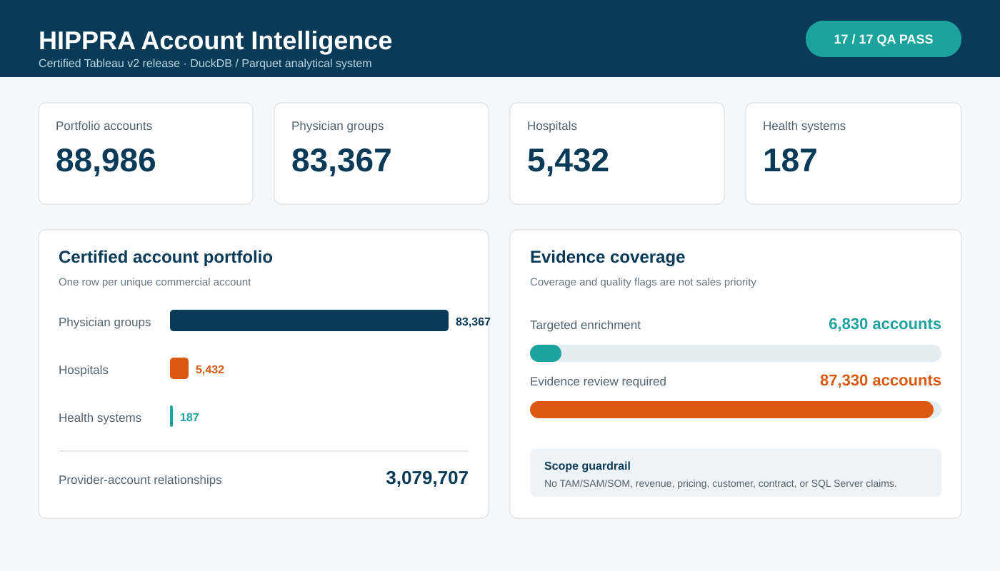

# Nexus 8 / HIPPRA Account Intelligence

Certified healthcare-account reconstruction and Tableau decision-support release for HIPPRA. The current analytical system is DuckDB and Parquet; the presentation layer is Tableau Public Desktop Edition saved locally as a packaged workbook.

Release status: **PASS** — 17/17 Tableau release checks passed, the packaged workbook opened successfully in Tableau Public 2026.2.1 on Apple silicon, and protected certified inputs remained unchanged.



## What this release contains

- A portable Tableau packaged workbook with 14 worksheets and 3 dashboards.
- A deterministic workbook generator, packager, and fail-closed QA script.
- Versioned build, package, Tableau-preparation, and enrichment evidence.
- Methodology and coverage documentation that preserves known limitations.

The dashboards are:

1. **Executive Account Landscape** — portfolio counts, account mix, provider relationships, top accounts, and enrichment coverage.
2. **Network and Geography** — approved state-level geography and provider-account network structure.
3. **Data Quality and Account Explorer** — enrichment status, evidence-review queue, and account-level exploration.

## Certified headline metrics

| Metric | Certified value |
|---|---:|
| Account rows | 88,986 |
| Unique commercial accounts | 88,986 |
| Physician groups | 83,367 |
| Hospitals | 5,432 |
| Health systems | 187 |
| Provider-account relationships | 3,079,707 |
| Accounts with targeted enrichment | 6,830 |
| Accounts requiring evidence review | 87,330 |

Review-attention is an evidence-quality flag, **not** a sales-priority score.

## Open the dashboard

1. Install the free Tableau Public Desktop Edition 2026.2.1 or later.
2. Download [dashboard/HIPPRA_Account_Intelligence_v2.twbx](dashboard/HIPPRA_Account_Intelligence_v2.twbx).
3. Open it locally in Tableau Public.

The packaged workbook contains its certified extract and does not require publication to Tableau Public. Publishing it online would make the workbook and its embedded data public; that is intentionally outside this release.

## Verify the repository release

Run the dependency-free repository verifier:

```bash
python3 scripts/verify_repository_release.py
```

For the source-environment reconciliation evidence, see [qa/HIPPRA_Account_Intelligence_v2_qa.json](qa/HIPPRA_Account_Intelligence_v2_qa.json).

## Analytical boundaries

This release is descriptive account intelligence. It does **not** claim or calculate:

- TAM, SAM, or SOM;
- revenue, pricing, contract value, implementation fees, renewals, expansion, or churn;
- customer, prospect, eligibility, or sales-priority status;
- undocumented MCO-to-clinic or MCO-to-network relationships;
- SQL Server execution or reconstruction.

Missing values remain null and are never interpreted as zero. Foreign, military, nonstandard, missing, and unresolved postal identifiers are not coerced into domestic ZIP codes.

## Known limitations

- Targeted clinic enrichment is partial.
- MCO-to-clinic/network coverage relationships are not documented in the certified evidence.
- AHRQ health-system linkage reflects calendar year 2023.
- Stage 12 retains unresolved candidates for human review.
- SQL Server-compatible DDL, transformations, and reconciliation remain a separate future stage.

## Repository layout

```text
dashboard/  Tableau TWB and portable TWBX
scripts/    deterministic build, package, and QA utilities
qa/         versioned machine-readable release evidence
docs/       methodology, coverage, and Tableau build guidance
assets/     curated dashboard preview
```

See [docs/ARCHITECTURE.md](docs/ARCHITECTURE.md) for the data flow and [docs/DATA_DICTIONARY.md](docs/DATA_DICTIONARY.md) for the dashboard-facing semantic layer.
