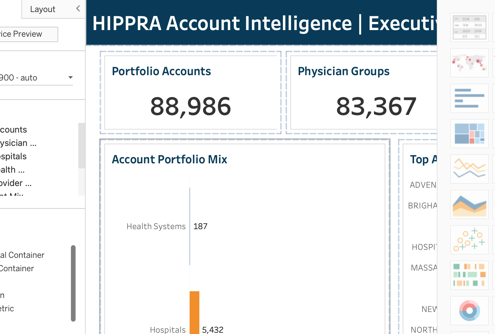

# How I Built HIPPRA's Healthcare Account Intelligence System

A file with 1.3 million provider records looks commercially useful until you try to answer a basic question: which organization is each clinician actually connected to?

That was the problem behind this project. HIPPRA was being developed as a collaboration platform for healthcare professionals. Individual clinicians could use the product, but organizations such as physician groups, hospitals, clinic networks, and health systems could also matter for partnerships, pilots, or enterprise adoption.

The federal data did not contain a clean table called `HIPPRA accounts`. It contained providers, practice organizations, enrollment records, hospital affiliations, owners, clinics, and health systems. Those files used different identifiers and described different kinds of relationships. A careless join could turn enrollment history into duplicate customers, a name match into a false parent company, or a missing percentage into zero ownership.

My job in this reconstruction was to turn those separate sources into a tested account model without claiming more than the evidence supported. I built the certified data foundation, resolved grain and missingness problems, created account and relationship marts, added targeted federal enrichment, prepared a stable Tableau source, and packaged a dashboard that opens without a database connection.

This repository is the account-intelligence part of the HIPPRA work. It explains who the identifiable organizations are and how providers are connected to them. It intentionally stops before TAM, SAM, SOM, pricing, revenue, customer eligibility, and sales prioritization.



## What I was trying to answer

The project centered on six questions:

1. Which physician groups, hospitals, and health systems can be identified from authoritative public data?
2. Which providers are connected to each account?
3. When does a repeated affiliation represent a duplicate, and when does it preserve meaningful enrollment history?
4. Which parent and child relationships are explicit enough to accept?
5. Which possible relationships should remain candidates for human review?
6. How can the final account model be explored without hiding missing or incomplete evidence?

The dashboard came last. Most of the work happened before Tableau, when I decided what each row and relationship was allowed to mean.

## Project at a glance

| Item | Project detail |
|---|---:|
| My role | Business Analyst Intern |
| Main tools | Python, SQL, DuckDB, Parquet, Hyper, Tableau |
| Provider source rows | 1,296,739 |
| Hospital source rows | 5,432 |
| Final commercial accounts | 88,986 |
| Physician-group accounts | 83,367 |
| Hospital accounts | 5,432 |
| Health-system accounts | 187 |
| Provider-account relationships | 3,079,707 |
| Providers linked to at least one final account | 1,072,710 |
| Accounts with targeted enrichment | 6,830 |
| Accounts with an evidence-review flag | 87,330 |
| Tableau worksheets | 14 |
| Tableau dashboards | 3 |
| Final Tableau release checks | 17 of 17 passed |

The 3,079,707 relationship rows are not 3,079,707 unique providers. One provider can have relationships with multiple organizations. The final Tableau source therefore uses one row per account, while relationship counts are carried as account-level measures.

## Why the account model was difficult

There was no single identifier shared by every source.

- Providers use NPI.
- Practices and physician organizations can use organization PAC ID or organization NPI.
- Hospitals use CCN or Facility ID.
- PECOS ownership data follows enrollment and associate identifiers.
- HRSA clinics use health-center and site identifiers.
- AHRQ health systems use their own system identifiers.

The files also had different grains. A provider file could have one row per NPI. An affiliation file could have one row per NPI, PAC enrollment, and hospital. An ownership file could have several owners for one enrollment. Flattening those sources into one table before understanding the grain would have inflated counts and erased useful lineage.

Missing values created another problem. A blank hospital rating may mean that the measure is unavailable or not applicable. A missing ownership percentage does not prove zero ownership. A military or foreign postal code should not be forced into a five-digit US ZIP format. I kept these conditions visible instead of making the data look more complete than it was.

## The source data

I combined fixed snapshots from CMS, HRSA, AHRQ, and a federal managed-care report.

| Source | Rows | Source grain | What it contributed |
|---|---:|---|---|
| Medicare Physician and Other Practitioners | 1,296,739 | Rendering provider NPI | Provider identity and descriptive measures |
| CMS National Downloadable File | Not stated here | Provider, organization PAC ID, practice location | Physician-group identity and provider-to-group links |
| CMS Facility Affiliation Data | 2,260,193 | NPI, PAC enrollment, hospital CCN | Provider-to-hospital relationships and enrollment lineage |
| CMS Hospital General Information | 5,432 | Hospital CCN | Hospital identity, type, geography, and rating context |
| CMS Hospital Enrollments | 9,175 | Hospital enrollment | Enrollment lineage used with ownership evidence |
| CMS Hospital All Owners | 147,332 | Enrollment and owner | Ownership evidence and limited system-parent relationships |
| HRSA health-center sites | 19,039 | Clinic site and Health Center Number | Clinic and clinic-network enrichment |
| CMS FQHC and RHC enrollments | Not stated here | Clinic enrollment and parent PAC relationship | Clinic identity and candidate resolution |
| AHRQ Compendium, 2023 | Not stated here | Published system and CCN relationship | Explicit hospital-to-system enrichment |
| Medicaid managed-care report | Not stated here | Program and plan | Plan identity only, with no clinic-coverage bridge |

For each source, I recorded the file checksum, size, row and column counts, schema, encoding, release period, and retrieval status. If a historical retrieval time was not available, I recorded `NOT_RECORDED`. I did not invent a timestamp to make the registry look complete.

The source files and local analytical database are intentionally not published here. This repository contains the curated Tableau release, code, documentation, and machine-readable QA.

## How I built it

### 1. I certified the foundation before extending it

The existing raw files, DuckDB database, Parquet files, and successful QA records became protected inputs. New stages wrote versioned outputs rather than replacing earlier successful work. Checksums made it possible to prove that the protected files remained unchanged.

This audit exposed a pipeline-state bug. A successful build had produced valid outputs and an analysis-ready marker, but a later state update supplied `status` twice and marked the run as failed. The data had not failed. The status-writing path had.

I preserved the contradictory historical record for audit, repaired the future state transition, and added regression tests covering:

- successful completion;
- a real processing failure;
- a stale PID file;
- interrupted cleanup;
- valid analysis-ready output;
- missing output files;
- failed QA.

The corrected workflow distinguishes `RUNNING`, `BUILD_READY`, `RELEASE_CERTIFIED`, `FAILED`, and `HUMAN_INPUT_REQUIRED`.

### 2. I handled affiliation grain before counting networks

The facility-affiliation data contained 47 repeated NPI and CCN combinations. Removing them as duplicates would have lost the fact that the same provider-hospital relationship could appear through different PAC enrollment records.

I kept two views:

- **NPI by hospital CCN** for network-size questions;
- **NPI by PAC enrollment by hospital CCN** when enrollment lineage matters.

That choice prevents network counts from being inflated while preserving the source history. The correct grain depends on the question, so the project stores both instead of silently choosing one.

### 3. I kept missing values separate from zero

Three examples shaped the missingness rules:

- **2,250 hospital ratings were missing.** The rating stayed null, with fields describing availability, applicability, and the missing reason.
- **89,838 ownership percentages were missing.** The value stayed null and received a missingness indicator. It was never interpreted as zero ownership.
- **27 provider postal values were not standard five-digit domestic ZIP codes.** I classified domestic standard, domestic nonstandard, military, foreign, missing, and unresolved values without padding, truncating, or converting them.

CMS suppression markers also stayed distinct from numbers. Blank and suppressed measures never became zero during parsing.

### 4. I defined what could become an account

The account model separates providers, physician groups, clinics, clinic networks, hospitals, health systems, managed-care plans, accounts, and contracts. These are different entities with different identifiers and business meanings.

The final identity rules were conservative:

- an organization PAC ID with an organization name can define a physician-group account;
- an organization NPI explicitly typed as `Clinic or Group Practice` can define a physician-group account;
- a hospital CCN with a hospital name can define a hospital account;
- a PECOS owner associate ID with an explicit chain or home-office flag can define a limited health-system account.

Names and addresses alone never merge authoritative identifiers. An exact normalized name and address can produce a candidate, but not a final identity. Fuzzy matching does not enter the certified account table.

For one targeted clinic-resolution rule, I required a CMS clinic enrollment to share the Stage 12 parent PAC ID and the exact normalized street, city, state, and five-digit ZIP prefix. Anything weaker stayed unresolved or went to review.

### 5. I separated entities from relationships

I built distinct account and bridge structures rather than flattening everything into a wide table:

- `commercial_account` stores one certified organization per account row;
- the provider-account bridge stores provider relationships to physician groups and hospitals;
- the parent-child bridge stores accepted organizational hierarchy;
- relationship-candidate tables store possible links that do not meet the final evidence rule;
- source-gap tables record relationships that the available source cannot establish.

The pipeline discovered source tables from their column signatures instead of relying on hard-coded table names. This made the reconstruction less fragile when a versioned upstream table name changed but its certified fields remained the same.

The account build produced:

- 83,367 physician groups;
- 5,432 hospitals;
- 187 health systems;
- 88,986 total certified accounts;
- 3,079,707 provider-account relationships.

## Targeted enrichment

The base account mart did not try to answer every organizational question. I added a separate, joinable enrichment layer using six versioned federal snapshots.

That layer identified:

| Enrichment output | Rows |
|---|---:|
| Authoritative clinic records | 35,789 |
| Clinic networks | 1,526 |
| Explicit clinic-to-network relationships | 19,039 |
| AHRQ health systems | 639 |
| Explicit hospital-to-system relationships | 4,193 |
| Managed-care plan identities | 818 |
| Clinic candidates requiring review | 337 |
| Other relationship candidates | 604 |

The Stage 12 reconciliation reviewed 310,759 candidates. It resolved 5,453 through the approved evidence rules and left 305,306 unresolved or requiring review.

One empty result is especially important: the managed-care source did not document plan-to-clinic or plan-to-network coverage. I left that bridge at zero rows. Filling it with plausible name or geography matches would have made the dashboard look richer, but the relationships would not have been supported by the source.

The [enrichment methodology](docs/targeted_enrichment_methodology.md) and [coverage report](docs/targeted_enrichment_coverage_report.md) explain those rules and gaps.

## Preparing the Tableau account layer

The final Tableau source contains 57 fields and exactly one row per `commercial_account_id`.

The fields include:

- account type, name, and authoritative identifier;
- state and safe postal classification;
- provider relationship count and unique linked provider count;
- direct child account count;
- candidate relationship count;
- targeted enrichment flag;
- AHRQ health-system linkage count;
- evidence-review flag and reason;
- a data-scope note displayed in the workbook.

Identifiers stay dimensions. Relationship measures are additive only at the account grain. Portfolio totals repeated on account rows must use `MIN` or `MAX`, not `SUM`. Those rules are documented in the [dashboard data dictionary](docs/DATA_DICTIONARY.md).

I packaged the source as a Tableau Hyper extract inside a portable TWBX. The workbook opens locally without a live DuckDB connection.

## What the dashboards show

### Executive Account Landscape

This dashboard answers the first portfolio questions:

- How many certified accounts exist?
- What is the mix of physician groups, hospitals, and health systems?
- How many provider-account relationships are represented?
- Which accounts have the largest linked provider networks?
- How much of the account mart has targeted enrichment?

### Network and Geography

This view explores account distribution by approved state geography and compares provider-network structure across accounts. Invalid or unsupported postal values are excluded from maps, but they remain in the underlying account table with their classification.

### Data Quality and Account Explorer

This dashboard makes the evidence limits visible. It shows enrichment coverage, accounts that require evidence review, and account-level details. The review queue is part of the deliverable rather than a hidden cleanup list.

The high review count needs context. The 87,330 accounts with `review_attention_required` are not 87,330 weak prospects. The flag means that at least one evidence limitation or unresolved relationship deserves attention. It is a data-review indicator, not a commercial score.

## What the final numbers mean

| Measure | Interpretation |
|---|---|
| 88,986 accounts | Organizations that passed the certified identity rules |
| 83,367 physician groups | Group accounts identified through approved PAC ID or organization-NPI evidence |
| 5,432 hospitals | Hospital accounts identified through CCN |
| 187 health systems | Limited system accounts supported by the approved PECOS owner rule |
| 3,079,707 provider-account relationships | Accepted links, with providers allowed to connect to more than one account |
| 1,072,710 linked providers | Distinct providers connected to at least one final account, about 82.7 percent of the provider source |
| 6,830 enriched accounts | Final accounts that received accepted targeted-enrichment evidence |
| 87,330 review-attention accounts | Accounts carrying an evidence-gap flag, not a sales-priority label |


The result is an organizational evidence layer. It can support account exploration, relationship analysis, enrichment planning, and later commercial work. It does not by itself establish demand, buyer eligibility, market size, or sales readiness.

## Technical architecture

```mermaid
flowchart LR
    A["Fixed federal source snapshots"] --> B["Certified DuckDB and Parquet foundation"]
    B --> C["Commercial identity rules"]
    C --> D["Account marts and relationship bridges"]
    D --> E["Targeted enrichment and review candidates"]
    E --> F["One row per account Tableau source"]
    F --> G["Hyper extract, TWB, and portable TWBX"]
    G --> H["Reconciliation, package, and Tableau-open QA"]
```



The current certified analytical system is DuckDB plus Parquet and CSV. Tableau reads the final account layer through Hyper. This pipeline was not executed in SQL Server. A SQL Server reconstruction would require separate DDL, transformations, and reconciliation.

The public repository contains:

```text
dashboard/  Tableau TWB and portable TWBX
scripts/    deterministic workbook generation, packaging, validation, and release verification
qa/         build, package, reconciliation, enrichment, and Tableau-open evidence
docs/       architecture, field definitions, methodology, release notes, and Tableau guidance
assets/     dashboard and release visuals
```

The broader technical design is documented in [`docs/ARCHITECTURE.md`](docs/ARCHITECTURE.md).

## How I validated the release

The final release checks covered both the account data and the Tableau package:

- 88,986 source rows reconciled to 88,986 unique account IDs;
- account IDs contained no nulls or duplicates;
- account-type counts reconciled to 83,367 physician groups, 5,432 hospitals, and 187 health systems;
- provider-account relationships reconciled to 3,079,707;
- targeted enrichment reconciled to 6,830 accounts;
- evidence-review flags reconciled to 87,330 accounts;
- protected input checksums remained unchanged;
- account-level measures were nonnegative;
- postal geocoding failed closed for invalid formats;
- the Tableau source reconciled across CSV, Parquet, and DuckDB;
- the TWBX archive passed integrity and checksum tests;
- the package contained the expected TWB, CSV, and Hyper members;
- all 14 worksheets and all 3 dashboards were present;
- required scope warnings appeared in the workbook;
- Tableau Public 2026.2.1 loaded and opened the packaged workbook with zero detailed errors.

The final result was 17 passed checks out of 17. The machine-readable evidence is in [`qa/HIPPRA_Account_Intelligence_v2_qa.json`](qa/HIPPRA_Account_Intelligence_v2_qa.json).

Run the public release verifier with:

```bash
python3 scripts/verify_repository_release.py
```

## Open the workbook

1. Install Tableau Public Desktop Edition 2026.2.1 or later.
2. Download [`HIPPRA_Account_Intelligence_v2.twbx`](dashboard/HIPPRA_Account_Intelligence_v2.twbx).
3. Open the workbook locally.

The packaged workbook includes the certified Hyper extract, so no database connection is required.

## What this project does not claim

This project does not claim that:

- all 88,986 accounts are HIPPRA prospects or eligible buyers;
- the account count represents TAM, SAM, or SOM;
- review-attention flags indicate commercial priority;
- a provider-account relationship proves employment;
- managed-care plans cover specific clinics or networks;
- missing ratings or ownership percentages equal zero;
- candidate relationships are confirmed links;
- HIPPRA earned revenue or signed customers from this work;
- the reconstructed pipeline ran in SQL Server.

Pricing, market sizing, and revenue forecasting belong to the separate HIPPRA commercial-analytics project. This repository provides an account and relationship foundation that can support those later questions when the evidence and business rules are available.

## What I learned

The hardest part was deciding when not to create a relationship.

It would have been easy to merge organizations because their names looked similar, drop repeated affiliations because their NPI and hospital matched, fill missing percentages with zero, or infer managed-care coverage from geography. Each shortcut would have made the output look cleaner. It also would have made the account model less trustworthy.

The final account table is useful because the unresolved evidence is still visible. I can explain why an organization became an account, which identifier supports it, how providers connect to it, which enrichment was accepted, and which questions still require human review.
