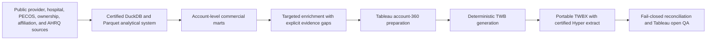

# Certified architecture

The release uses a deterministic, versioned chain. Each stage reads prior certified outputs and writes new artifacts; it does not overwrite successful historical stages.

## Control principles

- Raw files, certified DuckDB/Parquet outputs, and successful QA evidence are immutable inputs.
- Versioned outputs and SHA-256 checksums support audit and safe resume behavior.
- Missing and zero remain distinct.
- Ambiguous account relationships and unresolved candidates remain visible rather than being silently deduplicated or promoted.
- Tableau is a presentation layer; it does not redefine the certified account grain or source logic.

## Current platform boundary

The certified analytical system is DuckDB and Parquet. Tableau consumes the certified account mart through an embedded Hyper extract. SQL Server reconstruction was not executed and remains future work.
